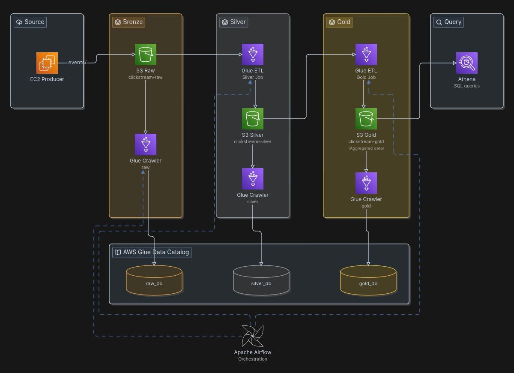

# Clickstream Lakehouse

A medallion-architecture clickstream pipeline on AWS. Generates synthetic events → S3 → Glue ETL → Athena.

## Architecture



## Components

| Component | Role |
|---|---|
| **EC2 Producer** | Python process running 24/7 as systemd service. Generates 15 events/sec via Markov chain, buffers 150, uploads JSONL to S3 Raw every ~10s. |
| **S3 Raw** | Stores partitioned JSONL (`events/year/month/day/`). |
| **S3 Silver** | Stores flattened, deduplicated Snappy Parquet. |
| **S3 Gold** | Stores 4 aggregate tables (daily_events, funnel, product_performance, user_segments). |
| **Glue Crawlers** | 3 crawlers (raw, silver, gold) that register S3 data in the Glue Data Catalog. |
| **Glue Silver ETL** | PySpark job: flatten nested payload → dedup on event_id → filter nulls → Snappy Parquet. |
| **Glue Gold ETL** | PySpark job: produces 4 aggregations from silver data. |
| **Amazon Athena** | SQL queries against any layer through the Glue Catalog. |
| **Airflow** | Hourly DAG orchestrating: crawl raw → silver ETL → crawl silver → gold ETL → crawl gold. |

## Testing

### 1. Check Producer is Running

```bash
EC2_IP=$(cd terraform && terraform output -raw producer_public_ip)
ssh -i ~/.ssh/clickstream-producer ec2-user@$EC2_IP "systemctl status clickstream-producer"
```

### 2. Verify Data in S3

```bash
aws s3 ls --recursive s3://clickstream-raw-{account}/events/ | tail -3
aws s3 ls --recursive s3://clickstream-silver-{account}/clickstream-silver/ | tail -3
aws s3 ls --recursive s3://clickstream-gold-{account}/clickstream-gold/ | tail -3
```

### 3. Run Full Pipeline

```bash
aws glue start-crawler --name clickstream-raw-crawler-dev
aws glue start-job-run --job-name clickstream-glue-etl-dev
aws glue start-crawler --name clickstream-silver-crawler-dev
aws glue start-job-run --job-name clickstream-glue-gold-dev
aws glue start-crawler --name clickstream-gold-crawler-dev
```

### 4. Query with Athena

```sql
-- Check event distribution
SELECT event_type, COUNT(*) as cnt
FROM clickstream_db_dev.events GROUP BY event_type ORDER BY cnt DESC;

-- Sample silver data
SELECT event_type, country, device, product_name
FROM clickstream_db_dev.clickstream_silver LIMIT 10;

-- Daily summary
SELECT * FROM clickstream_db_dev.daily_events ORDER BY year, month, day;

-- Top products
SELECT product_name, views, purchases, revenue
FROM clickstream_db_dev.product_performance
ORDER BY views DESC LIMIT 5;

-- Funnel
SELECT * FROM clickstream_db_dev.funnel ORDER BY year, month, day;
```

## Deploy

```bash
cd terraform
cp terraform.tfvars.example terraform.tfvars  # edit with your AWS values
terraform init
terraform apply
```

## Start Airflow (Optional)

```bash
docker compose up -d
docker compose exec airflow-webserver airflow variables set ENVIRONMENT dev
```

DAG runs hourly at `localhost:8081` (airflow/airflow).
